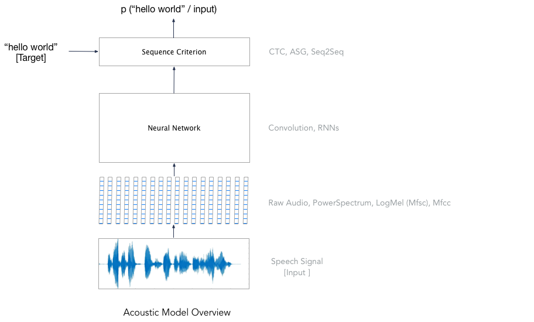

# Digit Recognition using wav2letter++

In this tutorial, we will train an end-to-end speech recognition system on digit recognition task.
We'll use the [Free Spoken Digit Dataset (FSDD)](https://github.com/Jakobovski/free-spoken-digit-dataset), an audio dataset consisting of recordings of spoken digits in wav files at 8kHz. 

Although the dataset is simple, the goal of this tutorial is to give a short introduction to training end-to-end speech recognition systems and using wav2letter++.

## Data Preparation

For a speech recognition dataset, we usually have access to a set of audio files and their transcriptions. Before preparing the dataset, we need to decide the sub-word units to be used for training the acoustic model (mode details on acoustic model later). These could be phonemes, graphemes, word-piece etc. Each word is represented as a sequence of these chosen sub-word units. In this tutorial, we will use graphemes as the sub-word unit.

Given training, validation and test sets, we would keep each of these sets in separate folders for preparing the dataset. We require 4 different files for each sample – audio file (.wav/.flac/…), its transcription (.wrd), transcription written in sub-word units (.tkn) and identifier file (.id) which can be used to represent speaker id and/or speaker gender and/or fileid etc.
You can read more details about data preparation [here](../../docs/data_prep.md). 

Since the dataset we are using does not come with separate train/valid/test sets, we divide the entire dataset randomly into 60% for training, 20% for validation and 20% for testing. Run the following command to download the dataset and prepare the data in the format required.


## Acoustic Model Training

During Acoustic model training, we train the model to produce the 



#### Feature Extraction
wav2letter++ currently supports multiple audio file formats (e.g. wav, flac... / mono, stereo / int, float) and several feature types including the raw audio, a linearly scaled power spectrum , log-Mels (MFSC) and MFCCs.
The features are computed on the fly prior to each network evaluation.
For this tutorial, we will use MFCC features which can be specified using the gflag `-mfcc`.

#### Defining the Neural Network
wav2letter++ provides an easy way to define `fl::Sequential` module using `-arch` and `-archdir` flags. This makes it easier to explore different network architectures with a single binary. 
It is also possible plugin your own custom network by defining new `fl::Module` .

For this tutorial, we will use the following 5 -layer Network with ReLU activations.

```
# network.arch
# Input Shape - TIMEFRAMES x NFEAT x NCHANNEL x BATCHSIZE
V -1 1 NFEAT 1        	# fl::View layer to convert input to appropriate shape for temporal convolution. 
     			# NFEAT is replaced with appropriate feature dimension size at runtime. 
C1 NFEAT 128 8 1 -1 	# Temporal Convolution with output channels = 128, filter size = 8, 
			# stride = 1 and “SAME” padding
C1 128 128 8 1 -1 
C1 128 128 8 1 -1 
C1 128 128 8 1 -1 
RO 2 0 3 1		# fl::Reorder Layer to convert input to appropriate shape for Linear layer
L 128 NLABEL 		# fl::Linear Layer with 128 input channels and `NLABEL` output channels.
			# NLABEL is replaced with appropriate token size at runtime. 

```

#### Choosing the Loss Criterion
wav2letter++ supports many end-to-end sequence models such as ConnectionistTemporalClassification, AutoSegmentationCriterion and Sequence-to-Sequence models with attention. For this tutorial, we will use CTC criterion which is specified using `-ctc` flag.

#### Training the Model
Documentation on training the models can be found here 


## Language Models and Decoding
#### Training Language Models
wav2letter++ currently support decoding using n-gram Language Models. We have abstracted away the logic for LM integration so that it is easy to plugin ConvLM, RNNLM etc.. and we plan to support them soon. For this tutorial, we will use [KenLM](https://github.com/kpu/kenlm) to train a simple unigram Language Model for our dataset. 

First download and build KenLM from source 


Prepare the data for LM training
Train the Language Model

 

#### Beam-search decoding
wav2letter++ uses beam-search decoder to find the best transcription for the given utterance. It supports tuning of hyperparameters like beamsize, beamscore, silweight, wordscore, lmweight etc. 
Typically, one should a grid search on these to find the hyperparameters on the validation set and use it for testing. 


## Conclusion
In this tutorial, we have trained a simple end-2-end speech recognition system to recognize English digits from 0 to 9. You can try the following things to explore wav2letter further
-	For the sub-word units, use phonemes instead of graphemes and train the end-2-end system entirely. 
-	Use ASG criterion instead of CTC criterion. 
